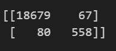
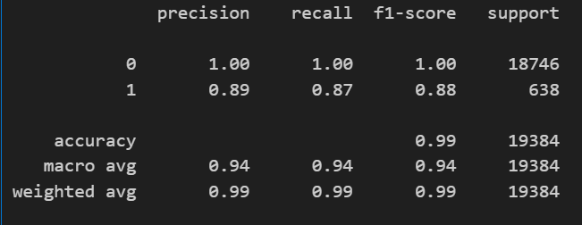

📚 Credit Risk Analysis

Welcome to the Credit Risk Analysis project! 🎉 This project aims to predict the risk status of loans using a logistic regression model. Below you'll find the steps taken to prepare the data, build the model, evaluate its performance, and the results obtained.

🚀 Getting Started
Data Preparation
Read the Data: The dataset lending_data.csv is read into a Pandas DataFrame.
Create Labels and Features:
Labels (y): The loan_status column (0: healthy loan, 1: high-risk loan).
Features (X): All other columns except loan_status.
Split the Data: Split the data into training and testing datasets using train_test_split.

📊 Results
Confusion Matrix:
]

Classification Report:

Performance Metrics
Accuracy: 94%
Precision:
Healthy loans (0): 100%
High-risk loans (1): 89%
Recall:
Healthy loans (0): 100%
High-risk loans (1): 87%
